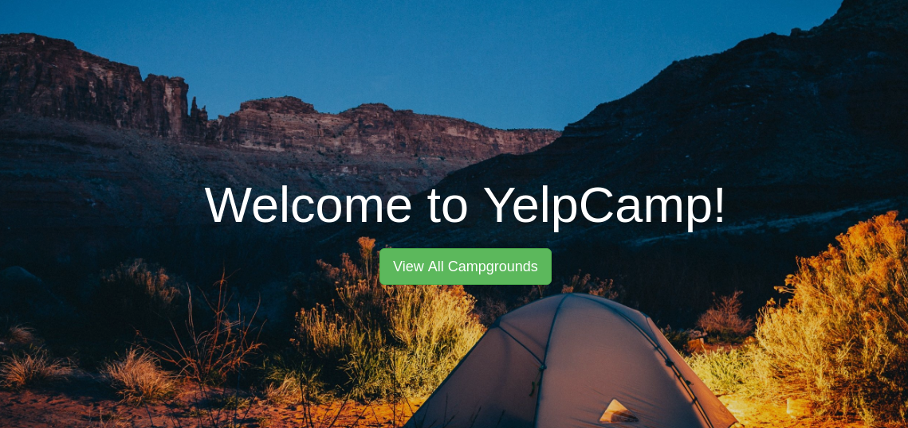

# YelpCamp Development 

A full-stack Node.js project with RESTful routing

## Initial Setup
* Add Landing Page
* Add Campgrounds Page that lists all campgrounds

Each Campground has:
   * Name
   * Image

## Layout and Basic Styling
* Create header and footer partials
* Add in Bootstrap

## Creating New Campgrounds
* Setup new campground POST route
* Add in body-parser
* Setup route to show form
* Add basic unstyled form

## Show Page
* Review the RESTful routes we've seen so far
* Add description to the campground model
* Show db.collection.drop()
* Add a show route/template

## Add the Comment model!
* Make comment errors go away!
* Display comments on campground show page

## Comment New/Create
* Discuss nested routes
* Add the comment new and create routes
* Add the new comment form

## Style Show Page
* Add sidebar to show page
* Display comments nicely

## Finish Styling Show Page
* Add public directory
* Add custom stylesheet

## Refactor The Routes
* Use Express router to reoragnize all routes

## Users + Comments
* Associate users and comments
* Save author's name to a comment automatically

## Users + Campgrounds
* Prevent an unauthenticated user from creating a campground
* Save username+id to newly created campground

## Editing Campgrounds
* Add Method-Override
* Add Edit Route for Campgrounds
* Add Link to Edit Page
* Add Update Route

## Deleting Campgrounds
* Add Destroy Route
* Add Delete button

## Editing Comments
* Add Edit route for comments
* Add Edit button
* Add Update route

## Deleting Comments
* Add Destroy route
* Add Delete button

